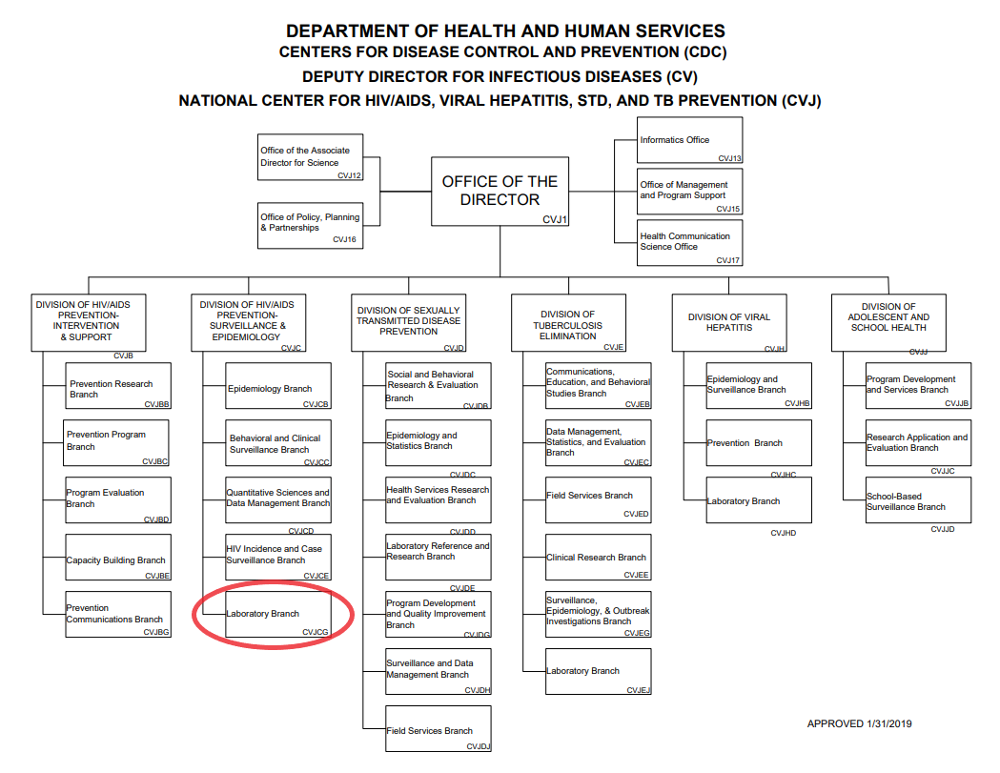
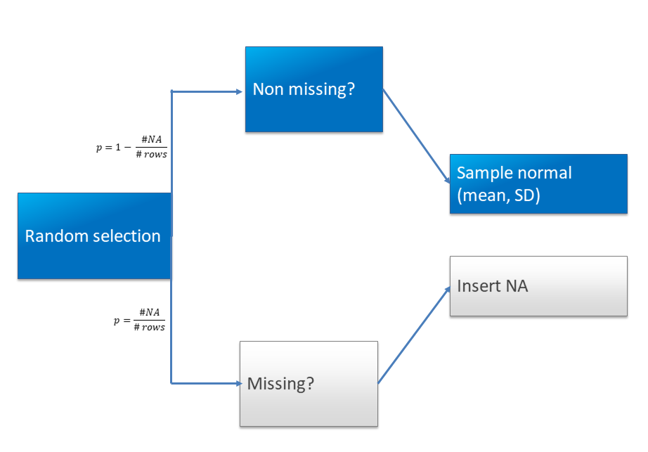

```{r setup, include=FALSE}
knitr::opts_chunk$set(echo = F)
```
## Team at CDC

* Molecular Epi and Bioinformatics Team within NCHHSTP (at CDC, of course)
* Laboratory support of investigations of new/emerging retroviruses
* Bioinformatics support to Public Health agencies nationwide
    * Eg. internal cluster to manage/store data MTNAB
* Analytical support to other groups in DHAP
* Suite of tools/software found [here](https://cdcgov.github.io/MEBT/)

## Organizational Chart 

{ width=100% }

::: notes
 photo obtained from https://www.cdc.gov/maso/pdf/NCHHSTP.pdf
:::

## The Problem

* Oftentimes, this group/CDC uses data with personally identifiable information (PII)
* Vetting new tools, but can't use live data
    * Security restrictions with use of PII
    * Scalable?
* Not only a CDC/Public Health problem
    * Likely that every market Leidos works in has this issue. Plus could be used internally.


## Potential Solution

* Demography SpawnR aims to solve this -- "recreates" a dataset based on distributions of variables in the original
* What is a distribution?
    * Basically, it's a list/function that gives all possible outcomes and likelihood they occur
    * Most common is the *normal* distribution, or *the bell curve* (continuous)
    * Can also have frequency distributions 
    
## Example Normal Distribution    

```{r, warning = FALSE}

library(ggplot2, quietly = T)
library(ggthemes, quietly = T)

### Different plots to show what a distribution is
dat = read.table("/Users/ishaandave/Desktop/gender-height.txt", sep = ",", header = T)

# hist(dat$Weight)

## Histogram of heights overall

overallHist = ggplot(dat, aes(x = Height)) +
  geom_histogram(aes(y = ..density.., color = "blue"),
                 fill = "lightpink", color = "darkred", alpha = 0.5, position = "identity", binwidth = 1, ) +
  geom_density(lwd = 0.65) + 
  ggtitle("Overall Histogram of Height")


overallHist

```

## Example Frequency Distribution 
```{r table-simple, warning = F}

library(pander)
panderOptions('table.split.table', Inf)
set.caption("The Great M&M Data")

my.data <- "Color   | Frequency | Percentage
    Brown           | 17        | 30.9%
    Red             | 18        | 32.7% 
    Blue            | 7         | 12.7%  
    Yellow          | 6         | 10.9%   
    Green           | 4         | 7.3%
    Orange          | 2         | 3.6%    
    Colorless/White | 1         | 1.8%"

df <- read.delim(textConnection(my.data), header = FALSE, sep = "|", strip.white = TRUE, stringsAsFactors = FALSE)

names(df) <- unname(as.list(df[1, ])) # put headers on

df <- df[-1, ] # remove first row

row.names(df)<-NULL

pander(df, style = 'rmarkdown')

```

    
## But...

* Overall, heights ~65 inches
* Sometimes, we don't know the whole story -- let's separate by gender
* There may be underlying patterns in the data we want to tease out
    * We just happen to know in this particular example

## Height by Gender

```{r}

onlyHist = ggplot(dat, aes(x = Height)) +
  geom_histogram(fill = "lightpink", color = "darkred", alpha = 0.5, position = "identity", binwidth = 1, ) + 
  ggtitle("Overall Histogram of Height")


histByGender = ggplot(dat, aes(x=Height, color=Gender)) +
   geom_histogram(fill="white", alpha=0.5, position="identity", binwidth = 1) +
   theme(legend.position = c(0.9 ,0.8),
         legend.text=element_text(size=8)) +
  ggtitle("Histograms of Heights by Gender")

## Density plots because why not
densByGender = ggplot(data = dat, aes(x = Height, color = Gender)) + 
    geom_density()


## Plotting overall and split + densities on 1 screen

Rmisc::multiplot(onlyHist, histByGender, densByGender, cols = 1)

```


## A pattern!

* Males generally taller than females
* We'd like to recreate similar pattern in output dataset
    * (More on this later)
    
    
## Now, what does this package do?

* Goes through variables and attempts to determine each type
    * Continuous, categorical, string, factor, dates, etc.
* A column with all different values is assumed to be sensitive information or PII
    * Name, address, SSN, etc.
        * *Usually*, these aren't important in analyses, replace with missing values/NA's. 


## How it works

* Computes/determines distributions of each variable
* If categorical, uses frequency/percentage of each level 
* For continuous variables, populates with random values that follow a normal distribution with respective means/SD
* Dates 
    * Generates kernel density estimate 
    * Used that as "distribution" and samples -- similar to an Epi curve


## Missing Values

* Categorical variables -- NA / missing is included as a category
* For continuous variables
    * percentage of missing values is calculated -> randomly inserted into each row with probability = original              
      proportion

## Decision Tree

{ width=110% height=75% }
    
    
## Usage Example


## Other functionalities

* List all pairwise combinations of variables -- continuous/continuous + categorical/categorical
* Correlations/associations and corresponding p-value for above combinations
* If user knows 2 variables to be correlated, able to input those and sample from bivariate distribution 


## Potential issues

* Handling with variables that contain zeros
* Categorical variables with several levels (e.g. *> 10* but *< # of rows*) 
* In bivariate sampling, variables strongly associated with 2+ others
    * Original: *Var A* associated with *Var B* and *Var C*
    * Sampled: No guarantees *Var A* associated with both after sampling
* Give user choice of which continuous distribution to use -- lognormal, gamma, weibull, exponential, etc.
    * Or have package just pick best fitting distribution
* If working with dates -- no way to guarantee *date2* comes after *date1* (e.g. patient starting/stopping drug)


## Package Website

* https://cdcgov.github.io/DemographySpawnR/

* Or click [**here**](https://cdcgov.github.io/DemographySpawnR/)


## Acknowledgements

* Tony Boyles
* Ellsworth Campbell
* Bill Switzer
* Sherry Ketemepi
* Stack Overflow


## Comments, Questions, Concerns?

* Thanks!

